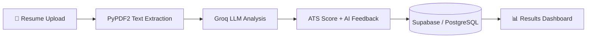
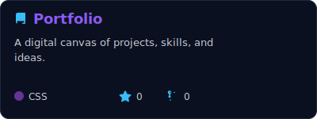
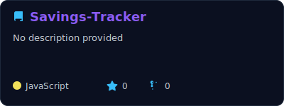
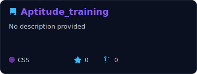
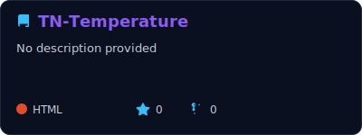
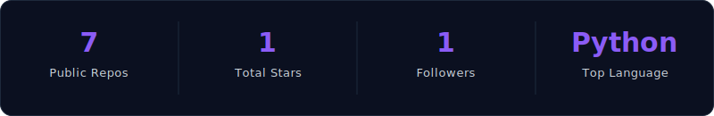

<!--
  Custom GitHub Profile README for jeevan-1805
  ---------------------------------------------
  SETUP:
  1. Create a repo named exactly "jeevan-1805" (must match your GitHub username).
  2. Make it Public. Commit this whole folder structure to its root:
       README.md
       assets/                      (pin cards + achievements SVGs)
       scripts/generate_cards.py    (regenerates the assets/ SVGs)
       scripts/repos.json           (edit this to add/remove pin cards)
       .github/workflows/update-cards.yml   (auto-refreshes assets/ daily)
       .github/workflows/snake.yml          (optional, see step 4)
  3. It will automatically appear on https://github.com/jeevan-1805
  4. Optional: the included snake.yml enables the animated contribution
     snake near the bottom — it needs no extra setup beyond being present
     in .github/workflows/.
  5. The WhatsApp button is optional — remove it if you'd rather keep that
     number off a public, highly-indexed page like your GitHub profile.
  6. update-cards.yml needs no secrets — it uses the GITHUB_TOKEN GitHub
     already provides to every workflow run.
-->

<a id="top"></a>

<div align="center">


<a href="https://jeevan-1805.github.io/Portfolio/">
  
</a>

<br/>

[](https://jeevan-1805.github.io/Portfolio/)
[](https://linkedin.com/in/jeevan-y-22784535b)
[](mailto:jeevany1806@gmail.com)
[](https://jeevan-1805.github.io/Portfolio/docs/Resume.pdf)
[](https://wa.me/919150006968)


<br/>

<a href="#about">About</a> •
<a href="#stack">Tech Stack</a> •
<a href="#projects">Projects</a> •
<a href="#journey">Education & Experience</a> •
<a href="#stats">GitHub Stats</a> •
<a href="#connect">Let's Connect</a>

</div>

<br/>

<a id="about"></a>

## 👋 About Me

<table>
<tr>
<td width="62%" valign="top">

I'm **Jeevan Y**, a BCA graduate from Chennai, India, who enjoys building software that feels *finished* — clean UI, solid backend logic, and AI features that solve a real problem instead of just existing for the demo.

- 🎓 BCA (Bachelor of Computer Applications), 2023 – 2026, aggregate **86.8%** (up to 5th semester)
- 🧠 Focused on **AI-assisted applications**, **Django/Flask backends**, and **full-stack web development**
- 💼 Completed a **Digital Marketing & AI Production** internship at *Anniyappa Publications*
- 🛠️ Comfortable across **Python, JavaScript, Django, Supabase/PostgreSQL**, and **LLM integration** (Groq API, IBM Granite)
- 🌱 Currently deepening skills in **prompt engineering** and production-grade AI workflows
- 👯 Open to **internships and full-time roles** in Python, AI, and full-stack development
- 💬 Ask me about: building AI features end-to-end, ATS/resume-tech, or Django + Supabase stacks
- ⚡ Fun fact: I'd rather ship a polished small feature than a messy big one

</td>
<td width="38%" align="center">

<br/><br/>

<table>
<tr><td align="center"><b>2+</b><br/>Major Projects</td><td align="center"><b>AI + Web</b><br/>Product Builder</td></tr>
<tr><td align="center"><b>86.8%*</b><br/>BCA Aggregate</td><td align="center"><b>Chennai</b><br/>India 🇮🇳</td></tr>
</table>

<sub>*up to 5th semester</sub>

</td>
</tr>
</table>

> 🔭 **Currently building:** AI-powered career tools that make ATS resume screening transparent and actually useful
> 🌐 **Full portfolio:** every project, certificate, and case study lives at **[jeevan-1805.github.io/Portfolio](https://jeevan-1805.github.io/Portfolio/)** — this profile is the quick tour, that site is the deep dive.

<div align="right"><a href="#top">↑ back to top</a></div>

---

<a id="stack"></a>

## 🧰 Tech Stack

<details open>
<summary><b>Languages</b></summary>
<br/>


</details>

<details open>
<summary><b>Frameworks & Libraries</b></summary>
<br/>


</details>

<details open>
<summary><b>Databases & Cloud</b></summary>
<br/>


</details>

<details open>
<summary><b>AI & Automation</b></summary>
<br/>


</details>

<details>
<summary><b>Tools, Platforms & Design</b></summary>
<br/>


</details>

<div align="right"><a href="#top">↑ back to top</a></div>

---

<a id="projects"></a>

## 🚀 Featured Projects

<table>
<tr>
<td width="50%" valign="top">

### 🤖 AI Resume Analyser
**AI-powered ATS resume evaluation platform**

A full-stack app that parses a resume, benchmarks it against ATS criteria, and generates AI feedback and an executive-summary rewrite for career improvement.

`Django` `Python` `Supabase` `PostgreSQL` `Groq API` `PyPDF2`

[](https://github.com/jeevan-1805/AI-Resume-Analyzer)
[](https://jeevan-1805.github.io/AI-Resume-Analyzer/)

</td>
<td width="50%" valign="top">

### 🎓 EduTutor AI
**Interactive AI Learning Assistant**

An educational assistant powered by the IBM Granite LLM that explains concepts, auto-generates quizzes, scores answers, and adapts to different user roles — built with Gradio.

`Python` `Gradio` `IBM Granite` `Prompt Engineering`

[](https://github.com/jeevan-1805/EduTutorAI)
[](https://jeevan-1805.github.io/Portfolio/docs/EduTutorAI-Certificate.pdf)

</td>
</tr>
</table>

<details>
<summary><b>🧩 How the AI Resume Analyser pipeline works</b></summary>
<br/>



</details>

### 📂 Other Repositories

<p align="center">
<a href="https://github.com/jeevan-1805/Portfolio"></a>
<a href="https://github.com/jeevan-1805/Savings-Tracker"></a>
<br/>
<a href="https://github.com/jeevan-1805/Aptitude_training"></a>
<a href="https://github.com/jeevan-1805/TN-Temperature"></a>
</p>

<div align="center"><sub>These cards are self-hosted SVGs in <code>assets/</code>, refreshed daily by <a href="./.github/workflows/update-cards.yml"><code>update-cards.yml</code></a> — no third-party server involved.</sub></div>

<div align="right"><a href="#top">↑ back to top</a></div>

---

<a id="journey"></a>

## 🎓 Education & Experience

<details>
<summary><b>🏫 Education Timeline</b></summary>
<br/>

**Bachelor of Computer Applications (BCA)**
K.C.S Kasi Nadar College of Arts & Science, Chennai — *Aug 2023 – May 2026*
Aggregate up to 5th semester: **86.8%**

**Higher Secondary Certificate (HSC)**
P.A.K Palanisamy Hr. Sec. School, Chennai — *Aug 2022 – May 2023*
Percentage: **85%**

</details>

<details>
<summary><b>💼 Internship Experience</b></summary>
<br/>

**Digital Marketing & AI Production Intern**
*Anniyappa Publications* — June 2025 – July 2025

Worked on AI-assisted creative production, multimedia content, branding materials, and digital presentation assets.


[📄 View Certificate](https://jeevan-1805.github.io/Portfolio/docs/DigitalMarketing.pdf)

</details>

<details>
<summary><b>📜 Certifications & Proof of Work</b></summary>
<br/>

| Certificate | Issuer | Link |
|---|---|---|
| Digital Marketing & AI Production | Anniyappa Publications | [View](https://jeevan-1805.github.io/Portfolio/docs/DigitalMarketing.pdf) |
| EduTutor AI Project Certificate | IBM / Academic Program | [View](https://jeevan-1805.github.io/Portfolio/docs/EduTutorAI-Certificate.pdf) |
| AI Resume Analyser | Live production build | [Launch Demo](https://jeevan-1805.github.io/AI-Resume-Analyzer/) |

</details>

<div align="right"><a href="#top">↑ back to top</a></div>

---

<a id="stats"></a>

## 📊 GitHub Analytics

<div align="center">


<br/>


<br/><br/>


<br/>
<sub>Self-hosted SVG in <code>assets/</code>, refreshed daily by <a href="./.github/workflows/update-cards.yml"><code>update-cards.yml</code></a> — computed live from the GitHub API, no third-party trophy server involved.</sub>

</div>

> ℹ️ The stats card, top-languages card, and streak card above still call the shared public `github-readme-stats.vercel.app` / `streak-stats.demolab.com` instances. They're generally reliable but can occasionally rate-limit like the trophy widget did. Say the word if you'd like these moved to the same self-hosted `assets/` + Action pattern used for the achievements strip and repo cards.

<details>
<summary><b>🐍 Contribution Snake (enable it in one step)</b></summary>
<br/>

Once the workflow below is added to this repo, this line will animate your contribution graph as a snake eating your commits:

```markdown

```

**To enable it:** create `.github/workflows/snake.yml` in this same `jeevan-1805` repo with the following, then push once — it'll run automatically after that:

```yaml
name: Generate Snake Animation

on:
  schedule:
    - cron: "0 0 * * *"
  workflow_dispatch:
  push:
    branches:
      - main

jobs:
  generate:
    permissions:
      contents: write
    runs-on: ubuntu-latest
    steps:
      - uses: actions/checkout@v4
      - name: Generate snake animation
        uses: Platane/snk@v3
        with:
          github_user_name: jeevan-1805
          outputs: |
            dist/github-contribution-grid-snake.svg
            dist/github-contribution-grid-snake-dark.svg?palette=github-dark
      - name: Push snake svg to the output branch
        uses: crazy-max/ghaction-github-pages@v4
        with:
          target_branch: output
          build_dir: dist
        env:
          GITHUB_TOKEN: ${{ secrets.GITHUB_TOKEN }}
```

</details>

<div align="right"><a href="#top">↑ back to top</a></div>

---

<a id="connect"></a>

## 🤝 Let's Connect

<div align="center">

I'm open to internships, freelance work, and full-time roles in **Python, AI applications, and full-stack development**. The fastest way to see everything I've built is my portfolio — the buttons below are the fastest way to reach me.

[](https://jeevan-1805.github.io/Portfolio/)
[](https://linkedin.com/in/jeevan-y-22784535b)
[](mailto:jeevany1806@gmail.com)
[](https://jeevan-1805.github.io/Portfolio/docs/Resume.pdf)

<br/>


<sub>Thanks for stopping by — this page is a summary, the full story is on my <a href="https://jeevan-1805.github.io/Portfolio/">portfolio</a> ⭐</sub>

</div>
